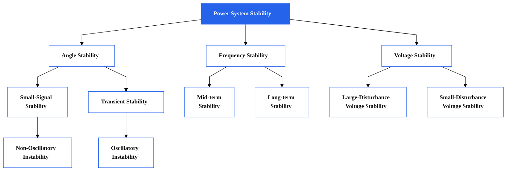

---
hide:
  - navigation
  - toc
---

<section style="padding:1rem 1rem; text-align:center; background:#f9fafb;">
  <h1 style="font-size:1rem; margin-bottom:1rem;">Power System Notes</h1>
  

    Documentation on foundational and advanced modeling techniques in power systems — including phasor-domain and EMT-domain analysis with applications in grid stability, renewables, and converter behavior.
  

</section>

  <h1 style="text-align:center; font-size:1rem; margin-bottom:1rem;">Power System Classification</h1>

  Reference: Power System Stability and Control - Second Edition

